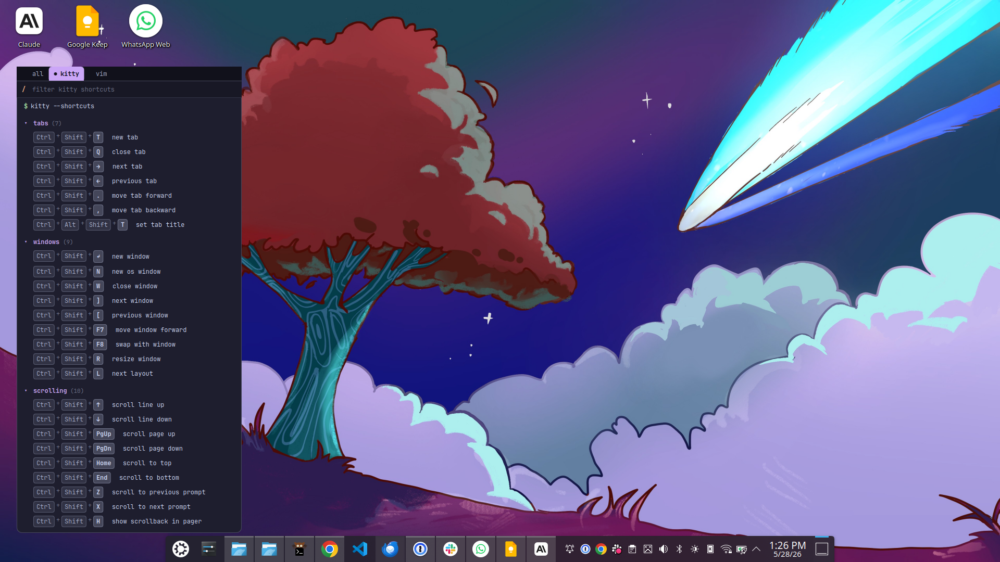
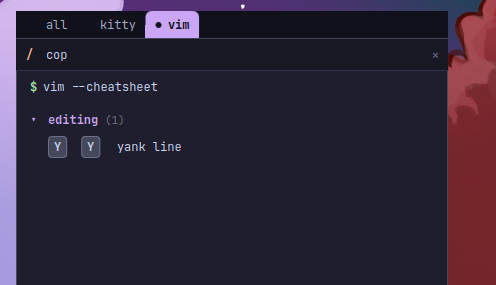

# cheatkat

[](LICENSE)
[](https://kde.org/plasma-desktop/)
[](https://www.qt.io/)
[](https://doc.qt.io/qt-6/qmlapplications.html)
[](https://github.com/catppuccin/catppuccin)
[](CONTRIBUTING.md)

A KDE Plasma 6 widget that shows your terminal-tool shortcuts as a tabbed, terminal-styled cheatsheet on your desktop.

It ships with the bundled defaults for each tool and merges in your own keybindings from the matching config file — so the widget always reflects what your tools actually do.



## Supported tools

| Tool | Defaults | Config source                                  | Plugin scan |
| ---- | -------- | ---------------------------------------------- | ----------- |
| kitty | ✓        | `~/.config/kitty/kitty.conf`                  | —           |
| vim / neovim | ✓        | `~/.vimrc`, `~/.config/nvim/init.vim` | opt-in      |

Adding a new tool means dropping in another module under `package/contents/code/` and registering it in `main.qml`'s `tools:` array — see [CONTRIBUTING.md](CONTRIBUTING.md).

### vim plugin keymaps

Three layers of vim keybindings are surfaced, each with its own source tag:

1. **`<Plug>` mappings in your vimrc** (always on). Lines like `nmap gd <Plug>(coc-definition)` are kept — the LHS is what you actually press, and the action label is derived from the `<Plug>` name. These land in the `plugins` category with the `user` tag.
2. **Plugin-defined defaults from `*.vim`** (toggle: *Scan plugins* in settings). Walks `~/.vim/plugged/`, `~/.vim/pack/*/start/`, `~/.local/share/nvim/site/pack/*/start/`, `~/.local/share/nvim/lazy/`. Scans both global and filetype-scoped mapping files:
   - `plugin/*.vim`, `after/plugin/*.vim` — always-active mappings
   - `ftplugin/*.vim`, `after/ftplugin/*.vim` — filetype-scoped (e.g. vimwiki's wiki-buffer bindings)

   Pre-greps to `:map`-style lines before parsing. Tagged with the plugin name (orange).
3. **Lua keymaps** (same toggle). Best-effort regex over `*.lua` in `plugin/`, `ftplugin/`, and `lua/` for `vim.keymap.set(...)` and `vim.api.nvim_set_keymap(...)`. Picks up `desc = "..."` when present. Tagged with the plugin name (orange).

User and default keys always win — a plugin entry with a key you've already bound is dropped, so the list stays unambiguous.

> **Helper-function gap:** plugins that define their user-facing defaults through a custom vimscript helper (e.g. vimwiki's `call vimwiki#u#map_key('n', s:map_prefix . 'w', '<Plug>VimwikiIndex', 2)`) won't be caught — the LHS is computed at runtime from a script-local variable, which a regex parser can't evaluate. The `<Plug>` definitions themselves are still captured under the plugin's name; you'll just see the abstract endpoints, not the resolved `<leader>ww` form. This is documented as a known limitation; covering it requires a partial vimscript interpreter.
>
> **Lua limitations:** lazy.nvim's `keys = { ... }` spec, which-key's `wk.register(...)`, and keymap calls split across multiple lines are **not** parsed. These need a real Lua tokenizer; the regex approach catches the common single-line patterns and skips the rest cleanly. Lua heredocs inside `init.vim` are also skipped.

## Features

- Catppuccin palette (Mocha / Macchiato / Frappé / Latte)
- Tabs at the top to switch between tools, with kitty's powerline tab styling
- Reads each tool's user config and overlays custom keybindings on top of bundled defaults
- Source labels on each entry — `user` (green) for your config, plugin name (orange) for plugin-defined defaults
- **Synonym-aware search** — type `cop` to find vim's `yank`, `save` to find vim's `:w`, `exit` to find `:q` and kitty's `close tab`

  

- Collapsible category sections with smooth expand/collapse animations
- Hover highlights and per-keycap rendering

## Requirements

- KDE Plasma **6.x** (uses `kpackagetool6`)
- Qt 6
- A monospace font installed — JetBrains Mono is recommended

Verified on Plasma 6.6.

## Install

```bash
git clone https://github.com/abacigil/cheatkat.git
cd cheatkat
./install.sh
```

Then right-click your desktop → **Add Widgets…** → search for **cheatkat**.

To upgrade after pulling new changes, run `./install.sh` again — it detects existing installs (including the legacy `org.kde.plasma.kitty-shortcuts` id) and replaces them cleanly.

If the widget doesn't seem to pick up new code, restart plasmashell so its QML cache is dropped:

```bash
pkill -9 plasmashell ; sleep 1 ; kstart plasmashell &
```

## Uninstall

```bash
./uninstall.sh
```

## Configuration

Right-click the widget → **Configure cheatkat…**:

| Option              | What it does                                                                                   |
| ------------------- | ---------------------------------------------------------------------------------------------- |
| Theme               | Pick a Catppuccin flavor                                                                       |
| Font family / size  | Monospace font and base pixel size                                                             |
| Parse user configs  | Toggle merging of user keybindings on top of bundled defaults                                  |
| kitty.conf path     | Override location of your kitty config                                                         |
| vim configs         | Comma-separated list of candidate vim/neovim configs; first one that exists wins              |
| Title bar           | Show/hide the traffic-light terminal title bar                                                 |
| Cursor              | Toggle the blinking trailing prompt cursor                                                     |

User-defined bindings show a small green `user` tag. If you reassign a default binding in your config, the original is dropped from the list (so a stale entry never lies to you).

## How config parsing works

### kitty.conf

- `kitty_mod ctrl+shift` — the modifier prefix used by all default bindings
- `map <keys> <action> [args]` — bindings, including `kitty_mod` substitution
- `map <keys> no_op` — clears a binding (filtered out of the widget)
- Backslash line continuations
- Comments (`# ...`) and blank lines

Modifier ordering is normalized (`shift+ctrl+t` and `ctrl+shift+t` match), and a handful of synonyms are aliased (`control` → `ctrl`, `cmd`/`super` → `meta`, `option` → `alt`).

### vim / init.vim

- `:map`, `:noremap`, and the per-mode variants (`:nmap`, `:nnoremap`, `:vmap`, `:vnoremap`, `:imap`, `:inoremap`, plus `xmap`, `omap`, `smap`, `tmap`, `cmap`)
- Mapping args (`<silent>`, `<buffer>`, `<expr>`, `<unique>`, `<nowait>`, `<special>`, `<script>`) are stripped
- Backslash line continuations
- `<C-x>` → `ctrl+x`, `<S-x>` → `shift+x`, `<A-x>` / `<M-x>` → `alt+x`, `<CR>` → `enter`, `<Esc>` → `escape`, `<leader>` kept as-is
- Uppercase ASCII letters (`G`, `Q`) are expanded to explicit `shift+g`, `shift+q` so they render distinctly from lowercase
- `<Plug>...` and `<SID>...` RHSs are skipped (they aren't real keystrokes)
- `<Nop>` and `:unmap` clear the corresponding default
- Lua heredocs (`lua << EOF ... EOF`) are skipped

## Project layout

```
package/
├── metadata.json                    # Plasma package manifest
└── contents/
    ├── ui/
    │   ├── main.qml                 # PlasmoidItem root + tool registry
    │   ├── FullRepresentation.qml   # Terminal-styled cheatsheet view
    │   ├── CompactRepresentation.qml
    │   ├── TabStrip.qml             # Tool tabs
    │   ├── CategorySection.qml      # Collapsible group
    │   ├── ShortcutRow.qml          # One shortcut line
    │   ├── KeyCap.qml               # Single styled key chip
    │   ├── Theme.qml                # Catppuccin palette
    │   └── configGeneral.qml        # Settings page
    ├── config/
    │   ├── main.xml                 # KConfig schema
    │   └── config.qml               # Config category registration
    ├── code/
    │   ├── shortcuts.js             # Shared merge / group / filter helpers
    │   ├── kitty.js                 # Tool module: kitty defaults + parser
    │   └── vim.js                   # Tool module: vim defaults + parser
    └── icons/
        └── cheatkat.svg

tests/                               # node-based parser + search tests
├── run.js
├── fixtures/
│   ├── kitty.conf
│   └── vimrc
├── parser.test.js
└── search.test.js
```

## Tests

```bash
node tests/run.js
```

Covers kitty + vim parser behavior, vim normalizer idempotence, and synonym-aware search across multi-tool data. Required to pass before merging PRs.

## Contributing

See [CONTRIBUTING.md](CONTRIBUTING.md) for the dev loop, the testing harness, and the recipe for adding a new tool tab. Issue reports and PRs welcome — open an issue first for bigger changes.

## Credits

- [kitty](https://sw.kovidgoyal.net/kitty/) by Kovid Goyal
- [Catppuccin](https://github.com/catppuccin/catppuccin) color palette

## License

MIT — see [LICENSE](LICENSE).
